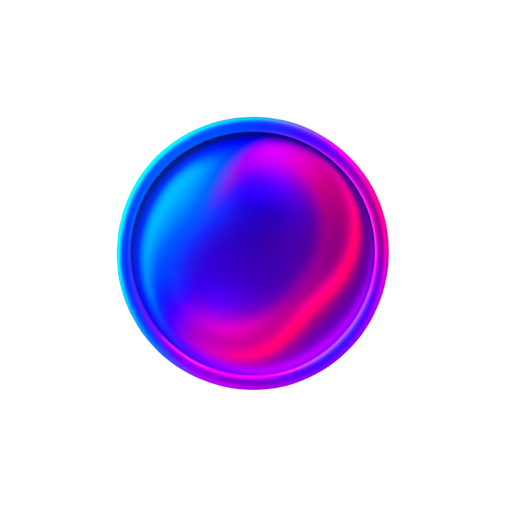

# TouchX UI

<p align="center">
  
  
  
  
  
  
  
</p>

<p align="center">
  <strong>🎭 Touchable Beautiful Animations · Living Component Library</strong>
</p>

<p align="center">
  A modern Vue3 component library focused on <strong>tactile experience</strong> and <strong>smooth animations</strong><br/>
  Bringing life to every interaction and delivering unprecedented immersive experiences
</p>

<p align="center">
  <a href="#getting-started">Getting Started</a> ·
  <a href="#components">Components</a> ·
  <a href="#design-philosophy">Design Philosophy</a> ·
  <a href="#architecture">Architecture</a> ·
  <a href="#documentation">Documentation</a>
</p>

<p align="center">
  <strong>English</strong> | <a href="README_ZHCN.md">简体中文</a>
</p>

---

## ✨ Core Features

**🎭 Living Tactile Experience**
Life-like touch feedback through precision physics engine. Elastic responses and damping effects make every interaction feel natural and engaging.

**🌊 Silky Animation System**
60fps smooth animations based on Bézier curves and physics. Intelligent easing adapts to interaction intensity for seamless visual continuity.

**💎 Modern Visual Language**
Glassmorphism aesthetics with frosted glass effects, dynamic lighting, and material simulations that bring real texture to digital interfaces.

**⚡ Performance Optimized**
Vue3 Composition API with Tree Shaking support, reducing bundle size by 50%+. Virtualized rendering and intelligent caching ensure stability.

**🎨 Enterprise Design System**
Complete Design Tokens with seamless theme switching. WCAG 2.1 AA accessibility standards for inclusive, beautiful products.

**📱 Cross-Platform Ready**
Responsive design optimized for all devices. PWA and SSR friendly - one codebase for all platforms.

## 🚀 Getting Started

### 📦 Installation

Choose your preferred package manager:

```bash
# npm
npm install @talex-touch/touchx-ui

# yarn
yarn add @talex-touch/touchx-ui

# pnpm (recommended)
pnpm add @talex-touch/touchx-ui
```

### 🔧 Full Import

```typescript
import { createApp } from 'vue'
import TouchXUI from '@talex-touch/touchx-ui'
import '@talex-touch/touchx-ui/dist/style.css'

const app = createApp(App)
app.use(TouchXUI)
app.mount('#app')
```

### 🎯 On-Demand Import (Recommended)

```typescript
import { createApp } from 'vue'
import { TxButton, TxAvatar } from '@talex-touch/touchx-ui'
import '@talex-touch/touchx-ui/dist/style.css'

const app = createApp(App)
app.use(TxButton)
app.use(TxAvatar)
```

### 🎨 Custom Theme (Coming Soon)

```typescript
import { createApp } from 'vue'
import TouchXUI from '@talex-touch/touchx-ui'
import '@talex-touch/touchx-ui/dist/style.css'

const app = createApp(App)

// Custom theme configuration
app.use(TouchXUI, {
  theme: {
    primaryColor: '#6366f1',
    borderRadius: '12px',
    animationDuration: '0.3s'
  }
})
```

### 💡 Quick Experience

```vue
<template>
  <div class="demo">
    <!-- Tactile Button -->
    <TxButton type="primary" @click="handleClick">
      Feel the Touch
    </TxButton>

    <!-- Flowing Avatar -->
    <TxAvatar
      src="https://example.com/avatar.jpg"
      size="large"
      glow
    />

    <!-- Glass Card -->
    <TxCard glass blur>
      <h3>TouchX UI</h3>
      <p>Bringing life to every interaction</p>
    </TxCard>
  </div>
</template>

<script setup>
const handleClick = () => {
  console.log('Can you feel it? This is TouchX!')
}
</script>
```

## 🎯 Design Philosophy

TouchX UI embodies an **interaction philosophy** - interfaces should feel alive and respond with warmth.

**Touch First** - Every interaction has soul through warm, textured feedback systems.
**Vitality** - Components breathe, express emotions, and anticipate user intentions.
**Flow Aesthetics** - Functional animations guide users while maintaining visual continuity.
**Material Experience** - Digital interfaces deserve real material sensations and textures.

## 🎨 Components

> 🚧 **Beta Version** - Currently in beta testing, more components coming soon!

### Foundation Components
- **TxButton** - Tactile buttons with elastic feedback and ripple effects
- **TxAvatar** - Flowing avatars with dynamic glow and breathing effects
- **TxForm** - Smooth form interactions with real-time validation

### Layout Components
- **TxCard** - Glass-morphism cards with multi-layer shadow systems
- **TxContainer** - Fluid containers with intelligent grid systems

### Interactive Components
- **TxSlider** - Physical feedback sliders with damping effects
- **TxSwitch** - Liquid-like flowing toggle switches

### Data Display
- **TxChart** - Dynamic charts with progressive entrance animations

### Feedback Components
- **TxToast** - Emotional message notifications with smart positioning

*🚀 More components in active development...*

## 🏗️ Tech Stack

Built with modern frontend technologies for high performance and maintainability:

- **Vue 3.4+** with Composition API and `<script setup>`
- **TypeScript 5.x** for complete type safety
- **Vite 5.x** for lightning-fast development
- **Vitest** for modern unit testing
- **CSS Variables** for dynamic theming
- **Tree Shaking** for optimized bundle size

## 📖 Documentation

- **[Documentation](https://touchx-ui.talex.cn)** - Complete component docs and API reference
- **[Playground](https://touchx-ui.talex.cn/playground)** - Interactive component playground
- **[Design System](https://touchx-ui.talex.cn/design-system)** - Design tokens and guidelines

## 🛠️ Development

```bash
# Clone and setup
git clone https://github.com/talex-touch/touchx-ui.git
cd touchx-ui
pnpm install

# Development
pnpm docs:dev          # Start documentation server
pnpm comp:play         # Start component playground
pnpm test              # Run tests
pnpm build             # Build library
```

## 🤝 Contributing

We welcome all contributions! Please read our [Contributing Guide](CONTRIBUTING.md) for details.

- 🐛 [Report Issues](https://github.com/talex-touch/touchx-ui/issues)
- 💡 [Feature Requests](https://github.com/talex-touch/touchx-ui/discussions)
- 🔧 [Submit PRs](https://github.com/talex-touch/touchx-ui/pulls)

## � License

[MIT License](LICENSE) © 2025 TalexDreamSoul

---

<p align="center">
  
</p>

<p align="center">
  <strong>🎭 Bringing life to every touch</strong><br/>
  <em>TouchX UI - Touchable Beautiful Animations</em>
</p>

<p align="center">
  <a href="https://touchx-ui.talex.cn">📖 Documentation</a> ·
  <a href="https://github.com/talex-touch/touchx-ui">⭐ GitHub</a> ·
  <a href="https://www.npmjs.com/package/@talex-touch/touchx-ui">📦 NPM</a> ·
  <a href="https://github.com/talex-touch/touchx-ui/discussions">💬 Discussions</a>
</p>
